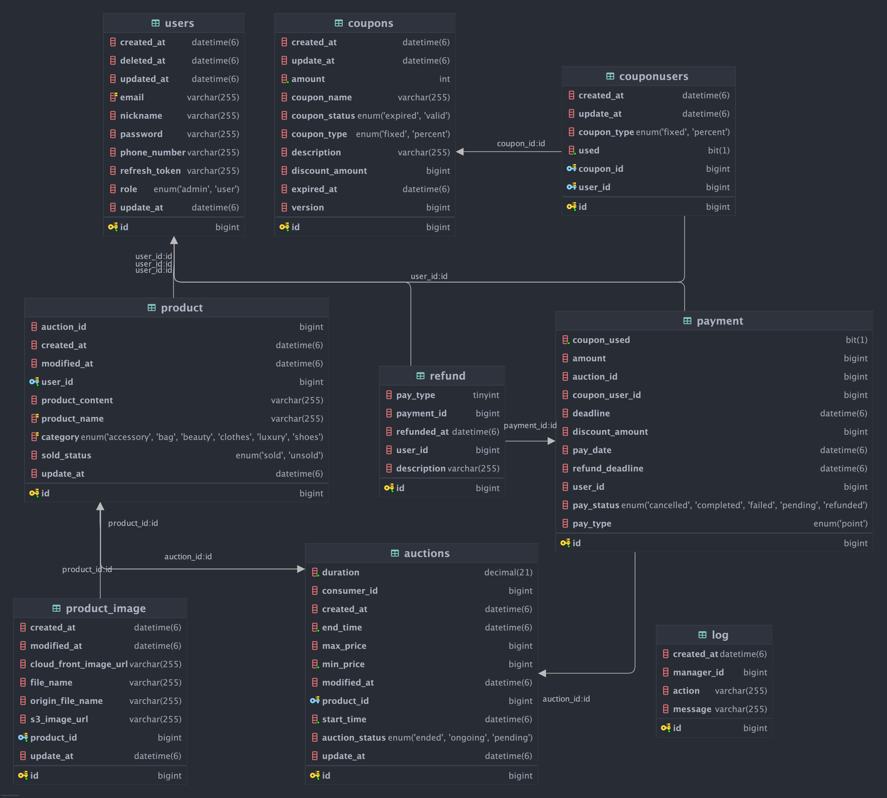

# 🛍 C2C 경매 서비스

  

 

## 🙋‍♂️팀원 소개

<table>
  <tr>
    <td align="center">
       
      
<b>팀장</b>

      
<a href="https://github.com/lh991117">이한빈</a>

      
경매

      
Redis와 Caffeine 성능 비교

      
검색 기능 강화

    </td>
    <td align="center">
       
      
<b>부팀장</b>

      
<a href="https://github.com/Seung-min-88">이승민</a>

      
결제

      
WebSocket 실시간 경매

      
스케줄링 서버

    </td>
    <td align="center">
       
      
<b>팀원</b>

      
<a href="https://github.com/pathfinder357">최유준</a>

      
애플리케이션 준비 및 컨테이너화

      
 Terraform 코드 작성 (IaC)

      
배포 환경 검증 및 트러블슈팅

    </td>
  </tr>
  <tr>
    <td align="center">
       
      
<b>팀원</b>

      
<a href="https://github.com/uyr83157">정의용</a>

      
BigQuery + GA4 활용한 통계 API

      
BigQuery ETL 파이프라인 구축

      
ELK 스택 로깅 + WAF 도입

      
메트릭 모니터링

      
Docker image 최적화

      <td align="center">
       
      
<b>팀원</b>

      
<a href="https://github.com/pathfinder357">송윤정</a>

      
쿠폰

      
AWS EventBridge

      
RestDocs API 자동화

      
분산락을 이용한 쿠폰 대량 발급

        <td align="center">
       
      
<b>팀원</b>

      
<a href="https://github.com/pathfinder357">박현승</a>

      
물품

      
물품 이미지 업로드

      
AWS S3 기반 이미지 저장 구조 구현

      
CloudFront 연동으로 로딩 속도 개선

  </tr>
</table>

 

## 📄프로젝트 소개
**개발 기간**: 2025.04.01 ~ 2025.05.06

`C2C 경매 서비스`는 사용자가 물품을 경매에 올리고 사용자가 실시간으로 물품을 경매할 수 있는 C2C 경매 사이트입니다.
 

## 🛠 기술 스택 
**라이브러리 & 프레임워크**  
  
   
**데이터 베이스 & 캐싱**   
 
    
**클라우드 & 인프라**  
 
 
  
**데이터 트래킹**  
  
**스토리지**  
  
**테스트 & 모니터링**  
 
   
**협업 및 문서화 도구**  
   
**컨테이너 & 배포**  
 
   

## ⚙️ System Architecture

  

 

## ⛓️ ERD

  

 

## 🧱[와이어프레임](https://docs.google.com/presentation/d/1J85rLEqN8q-g5gu4F7oyU-kvXNy68qDt/edit#slide=id.p6)
 

## 📰[API 명세서](https://www.notion.so/API-1e73dcf2500780479a9dd06e715e0f33?pvs=4)
 
 [RestDocs API](http://auction-market-restdocs-api-bucket.s3-website.ap-northeast-2.amazonaws.com/)

## 🎲 주요 기능
### 경매 생성 로직

 

### 경매 입찰 로직

 

## 🧭[기술적 의사결정](https://www.notion.so/1e83dcf250078033b6facf83fbd65b47?pvs=4)
 

## 🚨 [트러블 슈팅](https://www.notion.so/1e83dcf2500780b5bfb6f714fdc30c23?pvs=4)
 

## 🔑Key Summary
### 1. 이미지 응답 속도 최적화
**1-1. 문제 원인**  
- 동시에 많은 사용자가 제품 이미지를 조회할 경우 지연이 발생
- AWS S3을 사용할 경우 사용자와 이미지가 저장되어 있는 서버의 물리적 거리 멀수록 지연 시간 증가

**1-2. 기술 도입**  
- AWS CloudFront를 도입하여 사용자와 가까운 엣지 서버에서 데이터를 가져옴으로써 응답 속도 개선
  
**1-3. 성능 비교**  
<table>
  <tr>
    <td align="center">
      <dev><b> </b></dev>
    </td>
    <td align="center">
      <dev><b>AWS S3</b></dev>
    </td>
    <td align="center">
      <dev><b>AWS CloudFront</b></dev>
    </td>
  </tr>
  <tr>
    <td align="center">
      <dev><b>Samples</b></dev>
    </td>
    <td align="center">
      <dev><b>3000</b></dev>
    </td>
    <td align="center">
      <dev><b>3000</b></dev>
    </td>
  </tr>
  <tr>
    <td align="center">
      <dev><b>Avg(ms)</b></dev>
    </td>
    <td align="center">
      <dev><b>6262</b></dev>
    </td>
    <td align="center">
      <dev><b>2903</b></dev>
    </td>
  </tr>
  <tr>
    <td align="center">
      <dev><b>Min(ms)</b></dev>
    </td>
    <td align="center">
      <dev><b>119</b></dev>
    </td>
    <td align="center">
      <dev><b>98</b></dev>
    </td>
  </tr>
  <tr>
    <td align="center">
      <dev><b>Max(ms)</b></dev>
    </td>
    <td align="center">
      <dev><b>32614</b></dev>
    </td>
    <td align="center">
      <dev><b>31935</b></dev>
    </td>
  </tr>
  <tr>
    <td align="center">
      <dev><b>Error(%)</b></dev>
    </td>
    <td align="center">
      <dev><b>0</b></dev>
    </td>
    <td align="center">
      <dev><b>0</b></dev>
    </td>
  </tr>
  <tr>
    <td align="center">
      <dev><b>Throughput(req/s)</b></dev>
    </td>
    <td align="center">
      <dev><b>72.2</b></dev>
    </td>
    <td align="center">
      <dev><b>76.5</b></dev>
    </td>
  </tr>
  <tr>
    <td align="center">
      <dev><b>Received KB/s</b></dev>
    </td>
    <td align="center">
      <dev><b>36185.1</b></dev>
    </td>
    <td align="center">
      <dev><b>38330.6</b></dev>
    </td>
  </tr>
  <tr>
    <td align="center">
      <dev><b>Sent KB/s</b></dev>
    </td>
    <td align="center">
      <dev><b>14.8</b></dev>
    </td>
    <td align="center">
      <dev><b>14.0</b></dev>
    </td>
  </tr>
</table>

 

 

**1-4. 성능개선요약**  
- **평균 응답 시간**: 6262ms → 2903ms (약 54% 개선)
- **처리량**: 72.2 req/s -> 76.5 req/s (약 6% 개선)

 

### 2. 캐시별 조회 기능 개선
캐시가 미적용된 조회 기능과 Redis, Caffeine이 적용된 조회 기능을 테스트
- **테스트 주제**: 조회를 100번 시도 했을 때의 평균 응답 속도
- **테스트 결과** 
   
<table>
  <tr>
    <td align="center">
      <dev><b> </b></dev>
    </td>
    <td align="center">
      <dev><b>No Cache</b></dev>
    </td>
    <td align="center">
      <dev><b>Redis</b></dev>
    </td>
    <td align="center">
      <dev><b>Caffeine</b></dev>
    </td>
  </tr>
  <tr>
    <td align="center">
      <dev><b>Avg(ms)</b></dev>
    </td>
    <td align="center">
      <dev><b>5.26</b></dev>
    </td>
    <td align="center">
      <dev><b>10.05</b></dev>
    </td>
    <td align="center">
      <dev><b>0.12</b></dev>
    </td>
  </tr>
</table>

Caffeine → No Cache → Redis 순으로 응답 속도가 빠름

- **의문점**
  1. 왜 Redis가 느린가? 
     Redis는 기본적으로 외부 서버와 TCP 통신을 하기 때문 
     1. Java 객체 → JSON 직렬화
     2. Redis로 네트워크 전송
     3. 다시 역질렬화해서 Java 객체로 복구
  반면 Caffeine은 직접 JVM 메모리에서 객체를 바로 꺼내기 때문에 Redis보다 훨씬 빠름

  2. 그럼 No Cache보다 느린가?
     - 데이터가 작고 DB가 로컬에 있으면 단순 쿼리 실행이 Redis 통신보다 빠를 수도 있음
     - Redis는 캐시할 때 Jackson 직렬화/역직렬화가 항상 개임하기 때문에 그만큼 시간이 더 걸리게 됨
     - 캐시 미스가 발생해서 Redis가 무의미하게 조회되고 있을 수도 있음

  즉, 속도만 비교하면 Redis보다 Caffeine이 좀 더 우위에 있음을 알 수 있음

 

### 3. 캐시별 조회 기능 개선
MySQL vs 로컬 Elasticsearch vs AWS OpenSearch(퍼블릭 도메인)
- **테스트 방식**: 10000건의 더미 경매 생성 후 경매 목록 검색 속도 비교
- **테스트 결과** 
   
<table>
  <tr>
    <td align="center">
      <dev><b> </b></dev>
    </td>
    <td align="center">
      <dev><b>MySQL</b></dev>
    </td>
    <td align="center">
      <dev><b>Elasticsearch</b></dev>
    </td>
    <td align="center">
      <dev><b>OpenSearch</b></dev>
    </td>
  </tr>
  <tr>
    <td align="center">
      <dev><b>Avg(ms)</b></dev>
    </td>
    <td align="center">
      <dev><b>388</b></dev>
    </td>
    <td align="center">
      <dev><b>245</b></dev>
    </td>
    <td align="center">
      <dev><b>528</b></dev>
    </td>
  </tr>
</table>

- **의문점**
  - 어째서 OpenSearch의 소요 시간이 남들보다 훨씬 더 걸리는가?

  - 원인 분석
    원인은 AWS 외부와 통신이필요한 구조이기 때문임 
    로컬 Elasticsearch는 로컬이기 때문에 네트워크 지연이 없지만 
    AWS OpenSearch의 경우 AWS 외부와 통신을 하기 때문에 외부 호출로 인해서 시간 소요가 증가함

 
