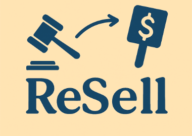

# 🛍 C2C 경매 서비스

  

 

## 🙋‍♂️팀원 소개
|    본인 이미지   [이름](https://github.com/hyeons22)   사진   한 일      |          |          |           |         |        |
| :------: | :------:|:------:|:------:|:------:|:------:|
 

## 📄프로젝트 소개
**개발 기간**: 2025.04.02 ~ 2025.05.06

`C2C 경매 서비스`는 사용자가 물품을 경매에 올리고 사용자가 실시간으로 물품을 경매할 수 있는 C2C 경매 사이트입니다.
이건 같이 생각해보자...
 

## 🛠 기술 스택 
**라이브러리 & 프레임워크**  
  
   
**데이터 베이스 & 캐싱**   
 
   
**클라우드 & 인프라**  
    
**테스트 & 모니터링**  
 
   
**협업 및 문서화 도구**  
   
**컨테이너 & 배포**  
 
   

## ⚙️ System Architecture

이미지 파일 github에 저장 후 사용
 

## ⛓️ ERD
이미지 파일 github에 저장 후 사용
 
 

## 와이어프레임
이미지 파일 github에 저장 후 사용
[와이어프레임](https://docs.google.com/presentation/d/1J85rLEqN8q-g5gu4F7oyU-kvXNy68qDt/edit#slide=id.p6)
 

## [API 명세서](https://www.notion.so/API-1e73dcf2500780479a9dd06e715e0f33?pvs=4)
 

## 🎲 주요 기능

이미지 파일 github에 저장 후 사용

## 🔑Key Summary

 

## 🧭[기술적 의사결정](노션링크)
 

## 🚨 [트러블 슈팅](노션링크)
 

## 최적화 전략 이부분을 🔑Key Summary 이걸로 해서 밑에 적은 4문항을 이미지 파일과 함께 채워넣기 -> 성능 비교가 가능한 인원이 적어주면 좋음
문제원인 
기술도입 
도입전후비교 
성능개선요약 
 

