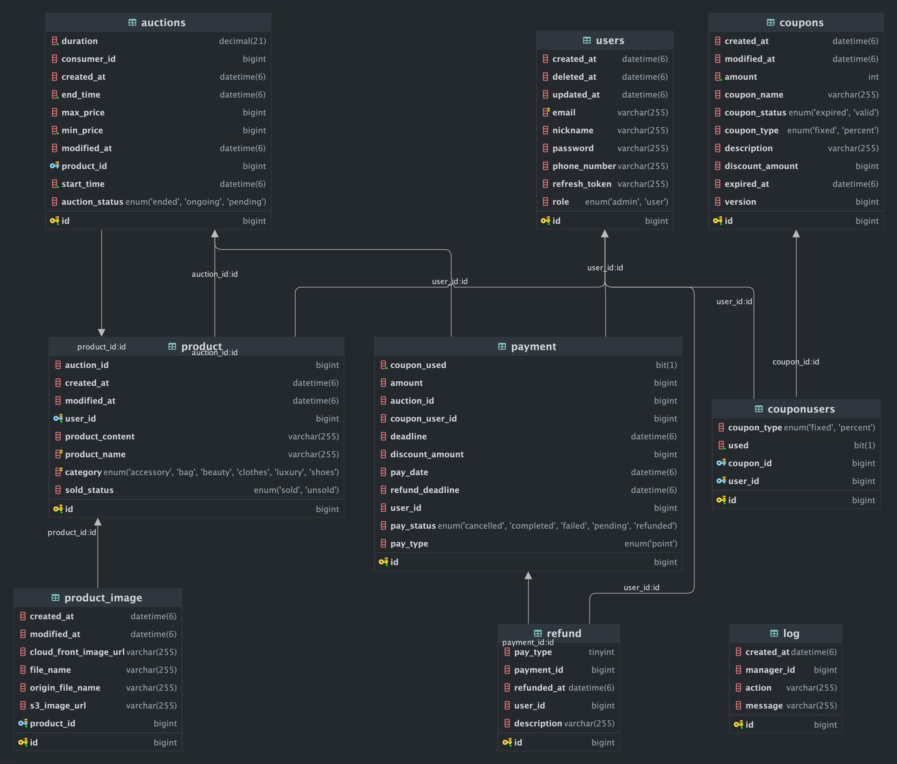

2조.Auction Market
----


---

## 🏷️목차


📄[프로젝트 소개](#프로젝트-소개)

⚙️[시스템 아키텍쳐](#시스템-아키텍쳐)

⛓️ [ERD](#erd)

🎲 [주요기능](#주요기능)

🛠️[기술스택](#기술스택)

🚨 [트러블슈팅](#트러블슈팅)

👥[팀원소개](#팀원소개)

## 📄프로젝트 소개


> 당근 마켓 + 경매를 합쳐서 소비자들이 물건을 경매 형식으로 사고 팔 수 있는 마켓
>

## **❓ 왜 만들었는가**


한정된 수량의 물품인 경우 일반 마켓에서는 온전히 선착순에 따라서 주인이 결정되기에 돈이 있음에도 불구하고 살 수가 없습니다. 그렇기에 경매 방식을 도입하여 선착순이 아닌 제한된 시간 안에 경매를 통해서 원하는 사람이 해당 물품을 얻을 수 있는 그런 구매 방식을 만들고 싶었습니다.

## ⚙️ 시스템 아키텍쳐


- **ARCHITECTURE**


## ⛓️ ERD

 

## 와이어프레임


[와이어프레임](https://docs.google.com/presentation/d/1J85rLEqN8q-g5gu4F7oyU-kvXNy68qDt/edit#slide=id.p6)

## API 명세서


- 추가 예정


## 🎲 주요 기능


### 물품 등록

- 판매자가 팔고 싶은 물품을 등록
- 물품을 동록할 때 카테고리 등록 가능, 물품 조회 기능 제공

### 경매

- 물품을 올린 판매자는 해당 물품을 경매에 등록할 수 있음
- 경매를 생성할 때에는 경매가 시작될 날과 경매의 진행 시간, 물품의 최소가를 등록할 수 있음
- 경매를 등록한 판매자는 본인의 경매를 수정하거나 삭제할 수 있음(단, 경매가 진행되면 수정, 삭제가 불가)
- 경매 등록시 WebSocket 서버로 요청을 보내 경매방 링크를 전달받음
- 경매 종료시 WebSocket 서버에서 받은 낙찰 정보를 통해 낙찰자에게 결제 요청

### 쿠폰

- 구매자는 낙찰된 물건의 금액을 지불할 때, 보유한 쿠폰으로 할인을 받을 수 있음
- 관리자는 일반 사용자들에게 대량으로 쿠폰 생성, 발급 가능

### 결제

- 결제시 결제 타입, 결제금액, 쿠폰 사용여부를 입력 후 결제 진행
- 결제 완료시 제품의 물품, 쿠폰(사용 시), 결제 상태변경
- 환불 시 결제 완료와 같이 상태 변경


## 🛠️ 기술 스택


### 🧱 기본 개발 환경

- **Java 17**
- **Spring Boot** (Spring Framework 3.4.4)
- **IntelliJ IDEA**
- **Gradle**


### 🗄️ 백엔드 기술 스택

- **Spring Boot** (Spring Framework 3.4.4)
- **Spring WebSocket**
- **SSE (Server-Sent Events)**
- **QueryDSL**
- **JavaFaker** - 더미 데이터 생성
- **Spring REST Docs (Asciidoctor)**
- **Spring Boot Actuator**

### 🗃️ 데이터베이스 / 캐시

- **MySQL**
- **Redis**
- **Elasticsearch**
- **AWS OpenSearch**


### ☁️ 클라우드 & 인프라

- **AWS EC2**
- **AWS ECS**
- **AWS S3**
- **AWS CloudFront**
- **AWS EventBridge**
- **AWS Lambda**
- **ECS Fargate**
- **ALB (Application Load Balancer)**
- **Terraform**
- **Fargate**


### 🐳 컨테이너 & 배포

- **Docker**
- **CI/CD**: GitHub Actions
- **GitHub**
- **GitHub Action**


### 📈 테스트& 모니터링

- **Postman**
- **JMeter** - 부하 테스트 도구
- **Logstash**
- **Kibana**
- **Prometheus**
- **Grafana**


### 📊 데이터 분석 & 트래킹

- **Google Analytics 4 (GA4)**
- **BigQuery**


### 🧰 협업 및 문서화 도구

- **Notion**
- **Stack 문서**
- **Zep**


[https://velog.io/@cyjtr357/스프링-프로젝트-개요-및-목표-아키텍쳐](https://velog.io/@cyjtr357/%EC%8A%A4%ED%94%84%EB%A7%81-%ED%94%84%EB%A1%9C%EC%A0%9D%ED%8A%B8-%EA%B0%9C%EC%9A%94-%EB%B0%8F-%EB%AA%A9%ED%91%9C-%EC%95%84%ED%82%A4%ED%85%8D%EC%B3%90)

[https://velog.io/@cyjtr357/AWS-인프라-구축-IaC-with-Terraform](https://velog.io/@cyjtr357/AWS-%EC%9D%B8%ED%94%84%EB%9D%BC-%EA%B5%AC%EC%B6%95-IaC-with-Terraform)

## 🚨 트러블 슈팅


- redis캐시를 통한 조회 시 직렬화 문제
    - 문제 상황

      redis를 사용한 조회 기능에서 첫 시도에 redis키를 생성하고 조회가 정상적으로 진행했지만, 두 번째 시도에서 직렬화 에러가 나타났음

    - 원인

      Redis에 객체를 캐시하거나 역직렬화할 때 `GenericJackson2JsonRedisSerializer`가 `AuctionResponse`를 인스턴스화하려고 시도하지만, 이 클래스에는

        - `@NoArgsConstructor`(기본 생성자 없음)
        - `@JsonCreator` 도 없음
        - 필드도 모두 `final`이어서 필드 기반 주입도 불가능

      즉, Jackson이 객체를 만들 수가 없었음

    - 해결 방법
        1. 기본 생성자 추가 + @Setter 추가
        2. 생성자 기반 역직렬화 설정(@JsonCreator사용)

      여기서 첫 번째 방법을 사용하여 해결

- AWS OpenSearch EC2 연결 실패
    - 배경

      AWS OpenSearch VPC 도메인을 구현하여 최종적으로 실행한 다음 날, 확인 차 한번 더 실행을 했었더니 OpenSearch가 막히는 에러가 발생하게 되었다.

    - 원인

      Chat GPT를 통해 원인을 분석한 결과 AWS OpenSearch 도메인은 생성 직후에 인증을 느슨하게 하지만, 시간이 지나면 강제적으로 IAM 인증을 요구하게 된다고 한다.

      즉, 시간이 지나서 보안 인증이 강력해졌기 때문에 익명 접근을 차단하면서 접근이 불가해진 것이다.

    - 과정

      그래서 이를 해결하기 위해서 여러 방법을 적용하게 되었다.

        1. IAM 인증을 위해서 보안 자격 증명

           IAM 인증을 위해서 AccessKey, SecretKey를 얻기 위해서 현 IAM유저의 보안 자격 증명을 진행하였고 이를 환경 변수로 넣어서 사용하게 되었다.


        1. AWS OpenSearch 권한 문제
            
            AccessKey와 SecretKey를 넣어서 서명 자체는 정확하게 진행됐지만 그 계정이 OpenSearch에 쓰기 권한이 없다는 것이다.
            
            이를 해결하기 위해서는 현재 사용하고 있는 OpenSearch Access Policies(액세스 정책)을 열어 현재 정책에 나의 IAM 유저를 추가해야한다고 한다.
            
    
    - 해결?
        
        일단 진행해봤지만 시간 상으로 해결을 하지 못할 것 같기도 하고, merge 이후에 진행을 할 때에도 제대로 작동이 될지에 대한 불안함이 있었기 때문에 VPC 대신 Public으로 OpenSearch를 사용하기로 변경하여 작성하게 되었다.
        
        결국, 원인 규명까지는 했지만 해결 과정에 다소 시간을 걸릴 것을 감안하여 다른 기술로 우회하기로 결정하게 되었다.

- AWS S3, AWS CloudFront 테스트 문제
    - 문제
      AWS S3, AWS CloudFront로 이미지를 가져오는 속도 테스트를 하기 위해 JMeter를 사용했다.
      작은 용량 이미지를 업로드할 경우 S3와 CloudFront의 응답 시간은 거의 일치했다.
      그래서 큰 용량의 이미지를 업로드할 경우로 다시 테스트 해봤고
      테스트 결과 1초 정도 밖에 차이가 나지 않았다.
      왜 차이가 얼마나지 않을까?
    - 원인
      테스트하려고 하는 것은 이미지를 가져오는 속도를 비교하는 것인데
      이번에 테스트한 것은 이미지를 가져오는 속도가 아닌 이미지 업로드 속도를 테스트한 것이다.
      이미지 업로드 속도는 업로드 당시 인터넷 상황에 따라 달라지기 때문에 차이가 일정하지 않았다.
    - 해결
      튜터님의 피드백을 듣고 코드와 무엇을 성능 비교해야 하는지를 다시 파악했다.
      코드 부분에 문제가 있어 이미지 파일이 업로드가 성공하면 S3에 저장된 이미지 파일을 가져오는 url, CDN으로 이미지 파일을 가져오는 url 이렇게 두 가지 값을 받을 수 있도록 수정했다.
- 트랜잭션 커밋 전 웹소캣 서버에서 경매방이 생성되는 문제

  ## 💥 문제 상황

  실시간 경매 시스템에서 메인 서버가 경매를 생성하고, 웹소켓 서버에 경매방을 만들도록 요청하는 구조였다.

  그런데 다음과 같은 문제가 발생했다:

  > ❗ 메인 서버에서 경매 생성이 실패했는데도, 웹소켓 서버에는 방이 생성돼버린다.
  >
    - 경매를 생성할 때 유효성 검증 오류 등으로 **DB에 저장이 되지 않았음**
    - 하지만 그 시점에서 이미 **웹소켓 서버에 경매방 생성 요청이 전달되어 실행됨**
    - 이후 다시 요청을 보내면 `auctionId`가 달라져 두 서버 간 **auctionId 불일치 문제** 발생

  ## 🔍 원인 분석

  문제의 핵심은 단순했다.

    ```java
    Auction saveAuction = auctionRepository.save(auction);
    
    // ❌ 이 시점엔 아직 트랜잭션 커밋되지 않았음
    webSocketClient.createAuctionRoom(...);
    ```

  즉, `@Transactional` 메서드 내부에서 DB 커밋이 완료되기도 전에

  **웹소켓 서버에 방 생성 요청을 보내버리는 구조**였다.

  > 만약 DB 저장이 실패하거나 롤백되면? → 웹소켓 서버에는 유령 경매방이 생겨버리는 상황
  >

  ## ✅ 해결 방법: `@TransactionalEventListener` 활용

  Spring에서는 **트랜잭션 커밋이 완료된 이후에만 실행되는 후처리 이벤트 리스너**를 제공한다.

  이를 활용해 다음과 같은 구조로 리팩토링했다.

  ### 1️⃣ 이벤트 클래스 정의

    ```java
    @Getter
    public class AuctionCreatedEvent {
        private final Auction auction;
    
        public AuctionCreatedEvent(Auction auction) {
            this.auction = auction;
        }
    }
    ```

  > 경매 생성 완료 시 `Auction` 객체를 담아 이벤트로 전달할 수 있도록 만든 단순 DTO
  >

  ### 2️⃣ 경매 생성 서비스에서 이벤트 발행 (AuctionService)

    ```java
    @Transactional
    public AuctionSaveResponse createAuction(...) {
        Auction savedAuction = auctionRepository.save(auction);
    
        // ✅ 트랜잭션 커밋 후 처리될 이벤트 발행
        eventPublisher.publishEvent(new AuctionCreatedEvent(savedAuction));
    
        return new AuctionSaveResponse(...);
    }
    ```

  > 기존에 들어있던 `webSocketClient.createAuctionRoom()`호출은 제거하고,
  >
  >
  > **대신 이벤트를 발행**함.
  >
  > 이 시점에는 **아직 트랜잭션 커밋 전**이므로, 실제 요청은 바로 나가지 않음.
  >

  ### 3️⃣ 트랜잭션 커밋 후 실행되는 리스너 작성

    ```java
    @Component
    @RequiredArgsConstructor
    public class AuctionEventListener {
    
        private final WebSocketClient webSocketClient;
    
        @TransactionalEventListener(phase = TransactionPhase.AFTER_COMMIT)
        public void handleAuctionCreated(AuctionCreatedEvent event) {
            Auction auction = event.getAuction();
    
            log.info("✅ 트랜잭션 커밋 완료 → 웹소켓 서버에 경매방 생성 요청");
    
            webSocketClient.createAuctionRoom(
                new WebSocketAuctionCreateRequest(
                    auction.getId(),
                    auction.getProduct().getProductName(),
                    auction.getMinPrice(),
                    auction.getStartTime(),
                    auction.getEndTime()
                )
            );
        }
    }
    ```

  > 이 리스너는**DB에 경매가 진짜 저장된 후에만 동작**하므로,
  >
  >
  > 유령 경매방이 생성되는 일을 완전히 방지할 수 있다.
  >

  ### 4️⃣ WebSocketClient 클래스는 기존 그대로 사용

    ```java
    public void createAuctionRoom(WebSocketAuctionCreateRequest request) {
        webClient.post()
            .uri(websocketUrl + "/internal/auction/join")
            .bodyValue(request)
            .retrieve()
            .bodyToMono(Void.class)
            .block(); // 동기로 요청
    }
    ```

  > 웹소켓 서버에 HTTP 요청을 보내 경매방을 생성하는 로직
  >

  ## ✅ 전체 흐름 요약

    ```java
    [메인 서버에서 경매 생성 요청]
           ↓
    AuctionService.createAuction()
           ↓
    DB에 저장 (아직 커밋 전)
           ↓
    이벤트 발행 (publishEvent)
           ↓
    트랜잭션 커밋 성공
           ↓
    @TransactionEventListener 실행
           ↓
    웹소켓 서버에 방 생성 요청
    ```

  ## 📘 회고

    - 분산 구조에서 한 서버의 결과를 다른 서버에 반영해야 할 때는

      **트랜잭션 커밋 전후를 구분하는 것이 매우 중요**하다.

    - Spring의 `@TransactionalEventListener`는 이런 케이스에서 매우 유용하며,

      시스템 안정성을 높이고 코드의 관심사 분리도 가능하게 한다.


## 👥 팀원 소개


<aside>

### 이한빈

| 역할 | MBTI | GitHub | Blog |
| --- | --- | --- | --- |
| 👑 리더 | INTP | https://github.com/lh991117 | https://phonebee.tistory.com/ |

🌊 맡은 일

- 경매 CRUD 제작
- 경매 조회에 Redis 및 Caffeine 구현 및 비교
- 경매 검색 기능 강화
- 발표
</aside>

<aside>

### 이승민

| 역할 | MBTI | GitHub | Blog |
| --- | --- | --- | --- |
| 👑 부리더 | INFP | https://github.com/Seung-min-88 | https://cork-7.tistory.com/ |

🌊 맡은 일

- 결제 CRUD 제작
- 실시간 경매서버 구현 (WebSocket)
- 스케줄링 서버 구현(Redis Pub/Sub)
</aside>

<aside>

### 최유준

| 역할 | MBTI | GitHub | Blog |
| --- | --- | --- | --- |
| 팀원 | ESTP | [https://github.com/pathfinder357](https://github.com/pathfinder357/) |  |

🌊 맡은 일

- 경매 사이트 회원 CRUD, JWT, Security, Boot Actuator, Validation
- Iac 인프라 구성을 위해 Terraform 작성
- 애플리케이션 컨테이너화(Docker)
- 배포 환경 검증 및 트러블 슈팅(AWS ECS, Faragate)
</aside>

<aside>

### 정의용

| 역할 | MBTI | GitHub | Blog |
| --- | --- | --- | --- |
| 팀원 | ISTJ | https://github.com/uyr83157 | https://velog.io/@dyd81032/posts |

🌊 맡은 일

- ELK 스택 로깅
- 메트릭 모니터링
- 빅쿼리 + GA4 연동, 자동적재
- 분석 API
</aside>

<aside>

### 송윤정

| 역할 | MBTI | GitHub | Blog |
| --- | --- | --- | --- |
| 팀원 | INFP | [Github](https://github.com/bopeep934)  | [Velog](https://velog.io/@gkinfn/posts) |

🌊 맡은 일

- 쿠폰 CRUD
- 쿠폰 대량 발급 - 동시성 제어를 위한 분산+낙관적 락 적용
- AWS Event Bridge를 이용한 만료된 쿠폰 상태 자동 변경
- Rest Docs API로 API 문서 자동화
</aside>

<aside>

### 박현승

| 역할 | MBTI | GitHub | Blog |
| --- | --- | --- | --- |
| 팀원 | ISFP | [hyeon-github](https://github.com/hyeons22) | [hyeon-blog](https://ski0123.tistory.com/) |

🌊 맡은 일

- 물품 CRUD
- 물품 이미지 업로드 기능
- 물품 이미지 불러오는 속도 비교 (AWS S3, AWS CloudFront)
- 물품 검색 속도 비교 (Index, Full-Text Index, Subquery)
</aside>


